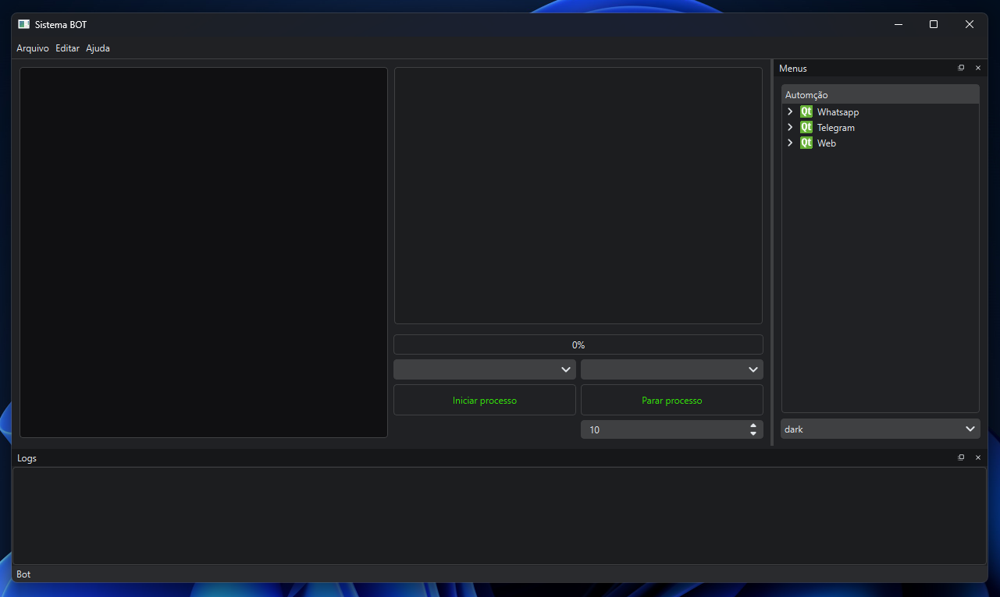

# COMANDOS ADB

## Gerar .xml UI
* adb shell uiautomator dump
* adb pull /sdcard/window_dump.xml

## Ativar ADB Keyboard
* adb install ADBKeyboard.apk 
* adb shell ime enable com.android.adbkeyboard/.AdbIME
* adb shell ime set com.android.adbkeyboard/.AdbIME 
* adb shell ime reset